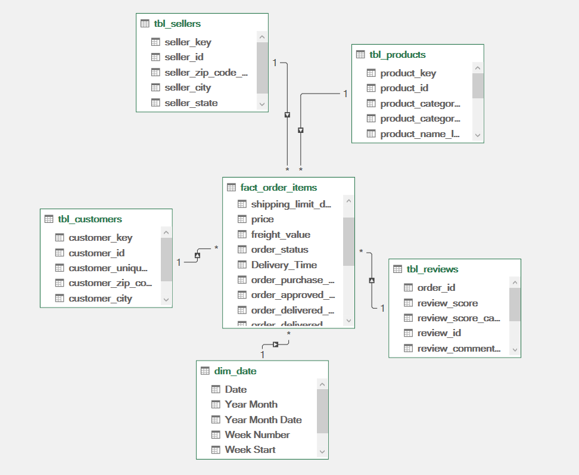

# Data Model Architecture Plan (Star Schema)

This document provides a clean and structured data model plan for the transformed "Olist E-commerce" dataset.

---

## 1. Fact Table

### `fact_order_items`
* **Grain:** One row = One unique order item (`order_id` + `order_item_id`).
* **Foreign Keys:**
  * `customer_key` (Links to `tbl_customers`)
  * `seller_key` (Links to `tbl_sellers`)
  * `product_key` (Links to `tbl_products`)
  * `order_id` (Links to `tbl_reviews`)
  * `order_date_key` (Links to `dim_date`)
* **Measures / Facts:**
  * `price`
  * `freight_value`
  * *Payment metrics (from `tbl_payments`) aggregated to the `order_id` level and integrated directly into this fact table.*

---

## 2. Dimension Tables

### `tbl_customers`
* **Primary Key:** `customer_key`

### `tbl_sellers`
* **Primary Key:** `seller_key`

### `tbl_products`
* **Primary Key:** `product_key`
* *Note: Includes integrated English category translations directly within this table.*

### `tbl_reviews`
* **Primary Key:** `order_id`
### `dim_date`
* **Primary Key:** `Date`

---

## 3. Relationships

All relationships are configured as **1:N (One-to-Many)**, where the filter naturally flows from the dimension table to the fact table:

* `tbl_customers[customer_id]` (1) → `fact_order_items[customer_id]` (*)
* `tbl_sellers[seller_id]` (1) → `fact_order_items[seller_id]` (*)
* `tbl_products[product_id]` (1) → `fact_order_items[product_id]` (*)
* `dim_date[Date]` (1) → `fact_order_items[date_key]` (*)
* `fact_order_items[order_id]` (*) → `tbl_reviews[order_id]` (1)

