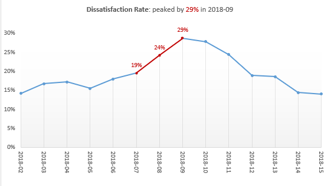
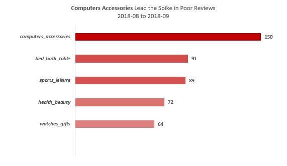
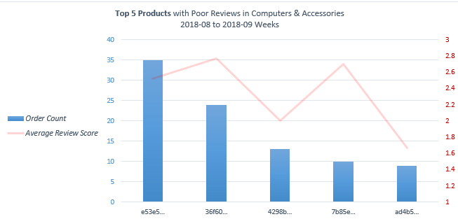
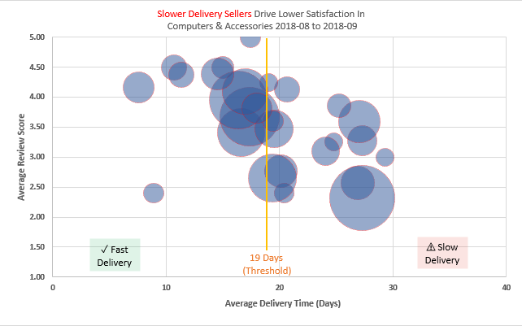

# Data Story: The 2018-09 Dissatisfaction Spike

Every e-commerce platform monitors customer satisfaction, but in the spring of 2018, the metrics signaled an operational crisis. This is the chronological story of how I tracked down a sudden surge in customer complaints, isolated the responsible category, and uncovered the operational bottleneck.

---

## Chapter 1 — The Sudden Flash Flood

For months, the weekly dissatisfaction rate (the percentage of orders receiving a review score of 2 or below) was predictable, hovering safely between 14% and 17%. However, the situation deteriorated rapidly heading into the spring. 

Starting in week **2018-07 (19%)**, the rate experienced a sharp upward trajectory, jumping to **24% in 2018-08** and reaching a massive peak of **29% in week 2018-09**. Nearly 1 in 3 customers were left highly dissatisfied. Fortunately, I observed the metric falling back to ~18% by 2018-12, confirming this was a severe temporary anomaly rather than a permanent structural decline.

---

## Chapter 2 — Computers & Accessories Led the Surge

To uncover the root cause, I isolated the weeks of the surge (**2018-08 to 2018-09**) and broke down the poor reviews by product category. 

The raw volume data pointed a clear finger: **computers_accessories led the platform with 150 poor reviews**. This volume far outpaced the next closest categories, such as `bed_bath_table` (91 poor reviews) and `sports_leisure` (89 poor reviews). 

---

## Chapter 3 — Sifting Through Product Specifics

Before blaming logistics entirely, I analyzed whether specific defective products within the category were driving the issue. Looking at the **Top 5 Products with Poor Reviews** within `computers_accessories`, I uncovered several distinct high-volume items:

* Product `e53e5...` was the largest contributor with **35 poor-review orders** and an average review score of ~2.5.
* Product `36f60...` followed with **24 poor-review orders**, maintaining an average review score of ~2.8.
* Product `ad4b5...` registered lower volume (**9 orders**) but saw its satisfaction plummet to a critical low average review score of ~1.6.

While I found these product-level trends to be significant, the widespread drop in satisfaction across multiple distinct IDs suggested a broader operational failure rather than isolated product defects.

---

## Chapter 4 — The Operational Smoking Gun: The 19-Day Threshold

To validate my operational hypothesis, I cross-referenced the average delivery time against the average review scores for all sellers within the `computers_accessories` category during the peak period. 

My analysis revealed a clear operational breaking point at the **19-day delivery threshold**:
* **Fast Delivery Zone (< 19 Days):** Sellers keeping their fulfillment times below 19 days successfully maintained healthy customer satisfaction, tightly clustered between 3.5 and 4.5 stars.
* **Slow Delivery Zone (>= 19 Days):** Once a seller’s average delivery time breached the 19-day mark, customer satisfaction collapsed. Every single seller in this zone dropped to an average review score below 3.5. 

The single largest bubble I identified in the slow zone—representing a high-volume merchant with nearly 30 delivery days—dragged their average review score down to a dismal ~2.3. This clear bottleneck confirmed my conclusion that severe logistical delays were the primary driver behind the 2018-09 dissatisfaction spike.

