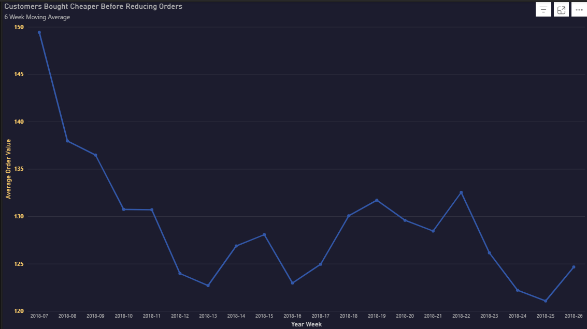
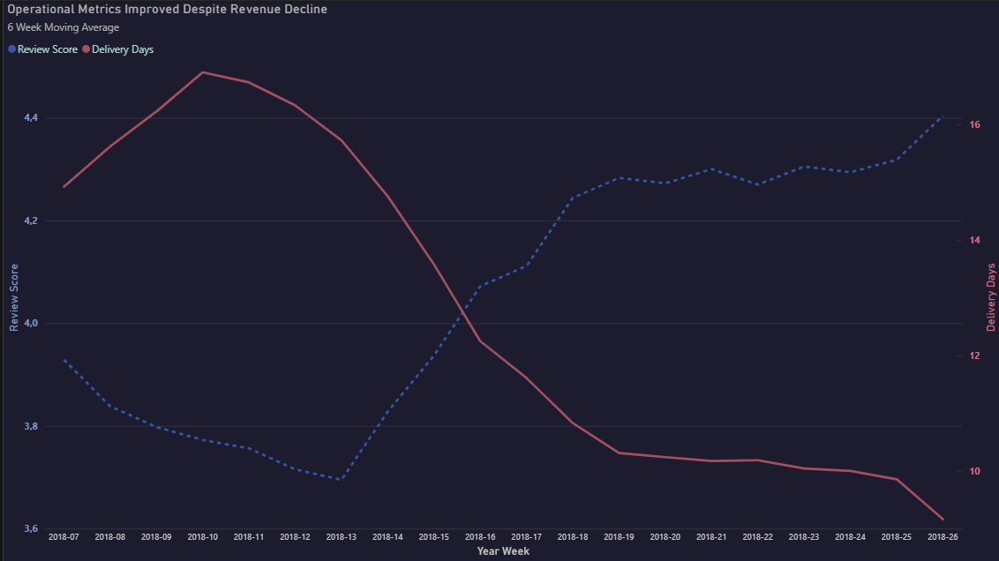
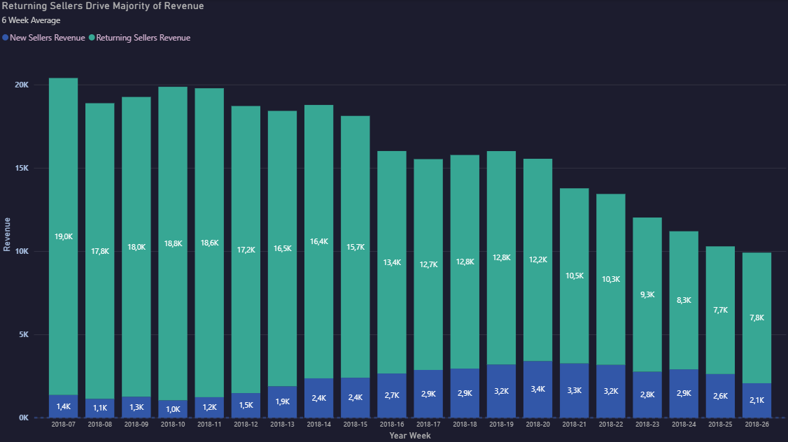

# Sports & Leisure Revenue Decline Analysis

**Period:** 2018-07 to 2018-26 · **Dataset:** Olist E-Commerce (Brazil)
**Method:** 6-week rolling average applied to line chart metrics

---

## Finding 1 — Early Revenue Drop Was Not Driven by Order Volume

Revenue declined from 2018-07 while orders remained. Orders only began steeply falling from 2018-14 onwards.

> The initial decline was not a demand problem. People kept buying at the same rate but spending less per transaction.

---

## Finding 2 — Customers Bought Cheaper Before Reducing Orders

AOV dropped sharply from **149 to 123** between 2018-07 and 2018-13 — while order volumes were still stable.

> Customers shifted to cheaper products before they stopped buying altogether.

---

## Finding 3 — High-Price Products Collapsed First

High-price products (>R$110) declined immediately from 2018-07 and lost **57% by 2018-26**. Mid and low segments held stable or grew slightly until 2018-14.

> This directly explains Findings 1 and 2 — customers replaced expensive purchases with cheaper ones, keeping order volume flat while revenue fell.

---

## Finding 4 — Operational Metrics Improved, Not the Cause

Delivery times peaked at ~16 days early in the period and improved to ~10 days by 2018-26. Review scores followed — dropping to 3.71 initially, then recovering to **4.40**.

> Both metrics improved while revenue kept falling. Operations were not the cause of the decline.

---

## Finding 5 — Returning Sellers Drove Revenue, New Sellers Could Not Compensate

Returning sellers generated the **vast majority of revenue** throughout the period. New sellers grew their share but sold at lower price points — unable to replace lost high-value transactions.

> With 89% of customers being one-time buyers, there was no loyal base to absorb the shock when high-value supply contracted.

---

## Conclusion

What is clear: the platform lost its highest-value transactions first, new sellers could not compensate at the same price level, and the absence of repeat customers left no buffer against the decline.
