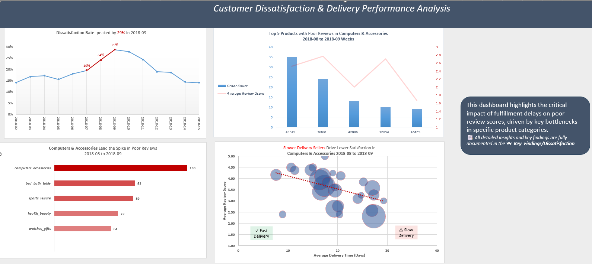
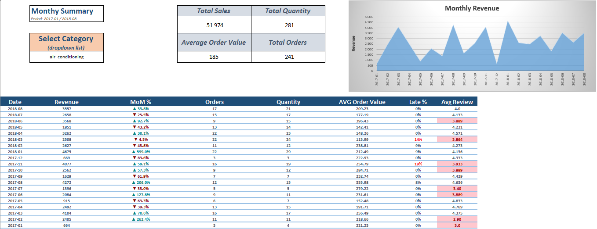
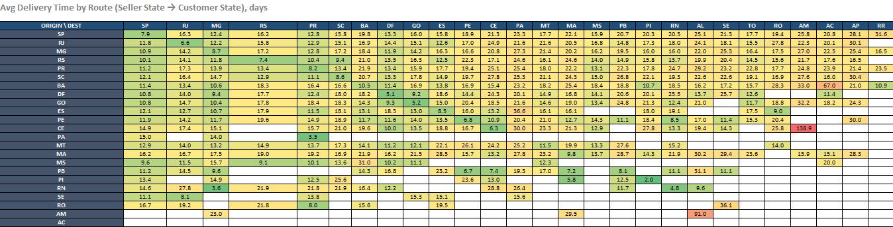
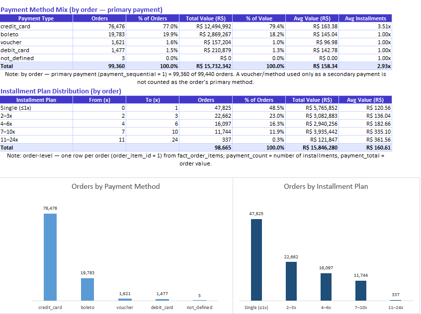
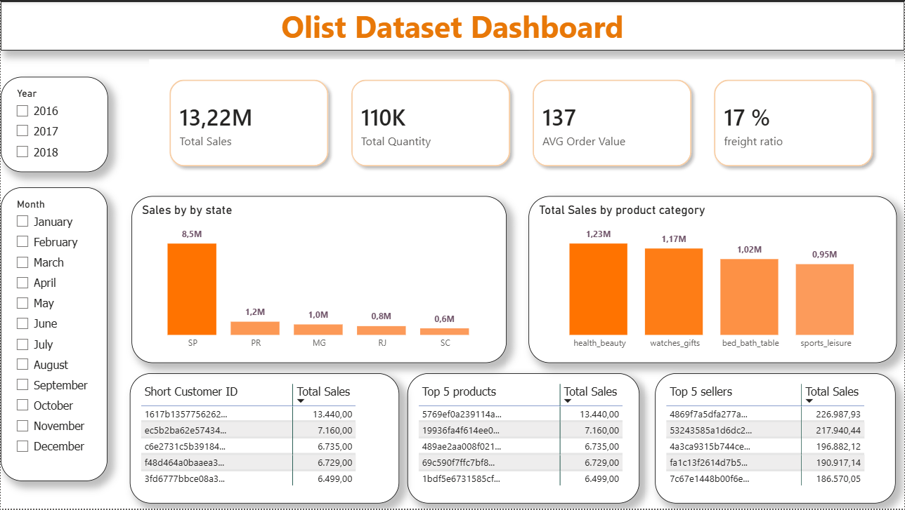
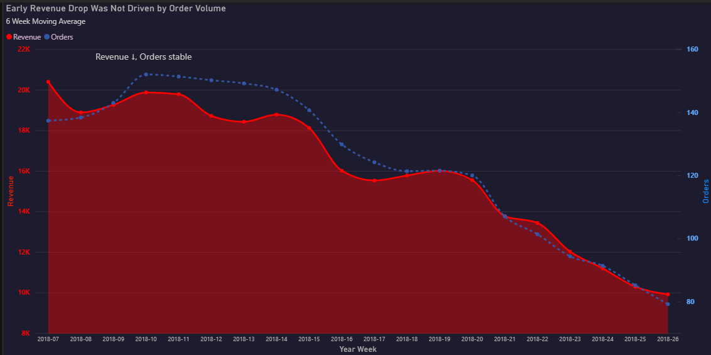
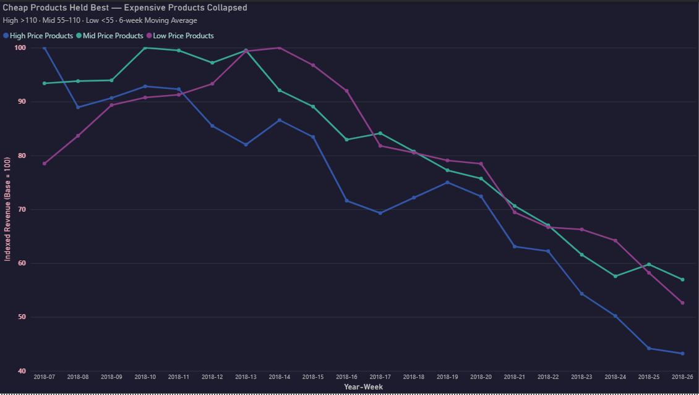

# olist_ecommerce_analytics

# Sports & Leisure Revenue Decline Analysis (Olist E-Commerce)

An end-to-end data analytics project focused on diagnosing a severe revenue drop within the **Sports & Leisure** category on the Olist e-commerce platform (Brazil). This project spans from raw data preparation and star-schema star modeling to Python-based advanced metric aggregation and Power BI visualization.

## 📊 Interactive Excel Dashboards

## Customer Dissatisfaction & Delivery Performance Analysis
A diagnostic dashboard tracing a spike in customer dissatisfaction back to its
root cause. 
Dissatisfaction peaked at 29% in 2018-09, driven primarily by the Computers & Accessories 
category. A delivery-time vs. review-score analysis shows that slower deliveries strongly 
correlate with lower satisfaction — identifying fulfillment delays as the key bottleneck.


### Monthly Summary (by category)
Dynamic dashboard with a category dropdown, tracking revenue, AOV, MoM% growth, 
late-delivery rate, and average review score per month.


### Delivery Time Matrix (Seller → Customer state)
Heatmap of average delivery times between origin and destination states, used to spot shipping bottlenecks across Brazil.


### Payment Method & Installment Analysis
Breakdown of payment mix (credit card vs. boleto) and installment-plan
distribution by order volume and total value.



## Interactive Power BI Dashboard

Interactive overview of the Olist dataset with Year/Month slicers, KPI cards (sales, 
AOV, freight ratio), and breakdowns by state, category, and top customers/products/sellers.


## 📊 Core Business Key Findings

### Finding 1 — Early Revenue Drop Was Not Driven by Order Volume
Revenue began a steady decline starting in week **2018-07**, whereas order volumes remained highly stable. A steep drop in actual transaction numbers only materialized later, from week **2018-14** onwards.
* **Insight:** The initial issue was not a lack of customer traffic or demand volume. Buyers were still purchasing at the same rate but spending less per transaction.




### High-Price Products Collapsed First
The high-price tier (>R$110) experienced an immediate downslide from week **2018-07**, ultimately losing **57% of its weekly volume** by **2018-26**. Conversely, the low and mid-price tiers remained completely resilient or experienced slight growth up until week **2018-14**.
* **Insight:** This explicitly explains the AOV contraction. The platform suffered a critical contraction in high-ticket transactions, which could not be offset by low-value sales.


---

# Getting Started: Project Setup & Execution Guide

This guide provides step-by-step instructions on how to set up, execute, and replicate the analytics pipeline for the Sports & Leisure revenue decline analysis.

---

## 📋 Prerequisites

Before running the project, ensure you have the following installed on your local machine:
* **Python 3.8 or higher**
* **Power BI Desktop** (for viewing the interactive dashboard)
* **Git** (for version control and repository cloning)

---

## 🛠️ Environment Setup

1. **Clone and Setup Project Environment:**
   Run the following commands in your Git terminal (`MINGW64` / Git Bash):

   ```bash
   # Clone the repository and enter the directory
   git clone https://github.com/jonas-butkevicius/olist_ecommerce_analytics.git
   cd olist_ecommerce_analytics

   # Create virtual environment
   python -m venv venv

   # Activate virtual environment (Windows Git Bash / MINGW64)
   source venv/Scripts/activate

   # Activate virtual environment (Windows Command Prompt)
   venv\Scripts\activate
   ```
   
# 🛠️ Project Architecture & Technical Stack

```text
├── 01_data_preparation/   # Star schema relational architecture diagrams
├── 99_key_findings/       # Generated analysis images and reports
├── python/                # Advanced Pandas data pipelines and aggregations
├── power_bi/              # Interactive tracking dashboards (.pbix)
├── olist_dataset_clean.xlsx # Master workbook containing data schemas and exploratory views
└── README.md
```

## 📂 File & Folder Descriptions

### 🟢 `olist_dataset_clean.xlsx` (Core Dashboards & Interactive Reports)

The central master workbook housing advanced data models and professional dashboards. All internal Pivot Tables, raw aggregations, and technical reference data are **cleanly hidden** in the background to ensure a polished user experience, leaving 4 main interactive sheets visible:

* **`Monthly Summary by category`** – A dynamic, high-level management dashboard featuring custom drop-down filters to track sales volumes, average order values (AOV), and Month-over-Month (MoM%) growth trends by specific product categories.
* **`Delivery Matrix`** – An operational logistics heatmap detailing the average delivery times (in days) routed between different origin (Seller) and destination (Customer) states to identify shipping bottlenecks.
* **`Payment Analysis`** – A financial distribution dashboard analyzing the e-commerce payment method mix (Credit Card vs. Boleto, etc.) and customer installment preferences by total value and order volume.
* **`Dissatisfaction Rate Report`** – An in-depth analytical performance dashboard linking fulfillment delays with low review scores, explicitly mapping out bad customer experiences across specific product categories and seller regions.

### 📁 Data Engineering & Modeling (`/01_data_preparation`)
Contains the relational architecture designs. The project implements a standard **Star Schema** data warehouse structure, linking localized order items (`fact_order_items`) out to dedicated dimension tables:
* `tbl_products`
* `tbl_sellers`
* `tbl_customers`
* `tbl_reviews`
* `dim_date`

### 📁 Advanced Analytics Pipeline (`/python`)
Contains the production Python scripts. Built on a Pandas data pipeline that automates:
* Data cleaning and formatting.
* Historical window partitioning using `.rolling(window=6, min_periods=1).mean()` to generate 6-week moving averages for smoothing cyclical volatility.
* Dynamic quantile distribution boundaries using `.quantile([0.33, 0.66])` for objective product price categorization.

### 📁 Data Visualization (`/power_bi`)
Houses the interactive `.pbix` tracking dashboards. The visual layer ingests the final Python-engineered datasets and utilizes optimized custom datetime indexing, dual-axis multi-metric trends.